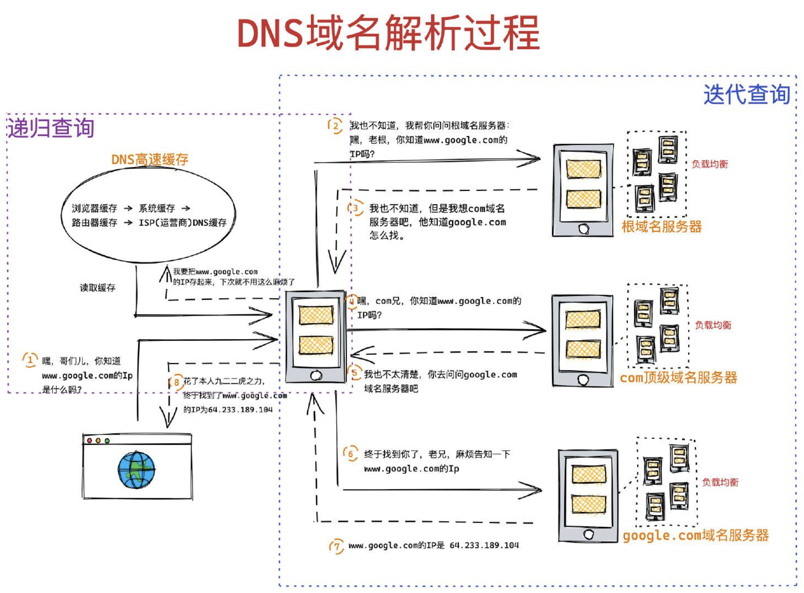

- 在发起http请求之前，浏览器首先要做去获得我们想访问网页的IP地址，浏览器会发送一个UDP的包给DNS域名解析服务器。
   

- 递归查询
  - 我们的浏览器、操作系统、路由器都会缓存一些URL对应的IP地址，统称为DNS高速缓存。这是为了加快DNS解析速度，使得不必每次都到根域名服务器中去查询。
  (浏览器缓存、系统缓存、路由器缓存、ISP（internt Service Provider）缓存)

- 迭代查询
  - 方式就是，局部的DNS服务器并不会自己向其他服务器进行查询，而是把能够解析该域名的服务器IP地址返回给客户端，客户端会不断的向这些服务器进行查询，直到查询到了位置，迭代的话只会帮你找到相关的服务器，然后说我现在比较忙，你自己去找吧。